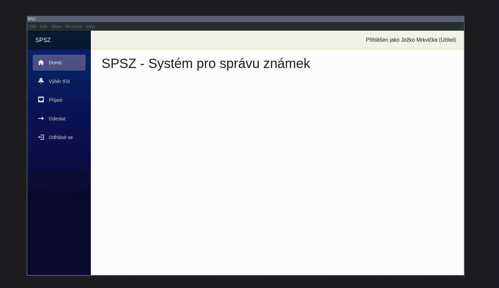

# SPSZ
Repository for my Information Systems Development course project

Goal: To make it look like it works :)

A lot of shortcuts were taken, during the development, because whole project was basically made in 2,5days

# Quick Start
```sh
$ dotnet restore
$ ./runweb.sh
```

- On windows you may need to copy databases to exe directory manually and run with `dotnet run`

To run as app, you need to download electron with
```sh
$ dotnet tool install ElectronNET.CLI -g
```
and then run with
```sh
$ cd SPSZui
$ electronize start
```

# Database tables:


# Features
- Login (dont judge me)
- Displaying student, classes, grades etc.
- Calculating average from grades
- Adding grades
- Sending mails (Teacher to Parent and Parent to Teacher)
- Receive mails, display them
- Saving everything to database and csv (selectable in [Config.cs](SPSZDataLayer/Config.cs))
- Exporting grades to CSV and TXT (selectable in app, download and preview)

# Quick preview

